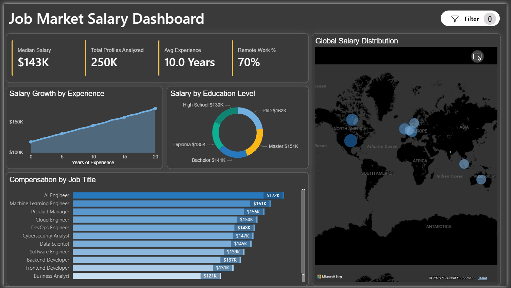

# Job Market Intelligence: Tech Salary Trends 📊

## 📌 Project Overview
The tech job market is often opaque, making it difficult for professionals and recruiters to benchmark compensation across different industries and specialized roles. This project provides a data-driven solution: an interactive executive dashboard that analyzes a large-scale dataset of over 250,000 tech jobs. 

By transforming raw, messy salary data into a clean, interactive visual tool, this project enables stakeholders to instantly identify compensation drivers and market premiums across various tech sectors.

## 💡 Key Business Insights
The dashboard provides immediate, high-level intelligence at a glance:
* **Market Baselines:** Tracks a macro view of the market with a **$146K Average Salary** and a **$143K Median Salary**, establishing a strong baseline for compensation analysis.
* **Industry Leaders:** Uncovered that the **Education ($145,994)** and **Media ($145,891)** sectors currently offer the most competitive average compensation for tech talent, outpacing traditional Finance and Consulting sectors.
* **Granular Filtering:** Features dynamic navigation allowing users to slice the data across 12+ specialized roles (e.g., Data Analyst, AI Engineer, Cloud Engineer) to see how industry rankings shift per job title.

## 🛠️ Tech Stack & Methodologies
* **Data Preparation & Cleaning:** SQL (Handling missing values, standardizing job titles, removing duplicates)
* **Business Intelligence:** Power BI
* **Calculations:** DAX (Dynamic measures for averages, medians, and aggregations)
* **Design Principles:** UI/UX Data Storytelling, Cognitive Load Reduction

## ⚙️ Development Process

### 1. Data Extraction & Transformation (SQL)
* Extracted the raw dataset containing hundreds of thousands of job postings.
* Cleaned the data by standardizing salary formats, removing outliers, and normalizing job titles into distinct, analyzable categories.

### 2. Data Modeling & DAX (Power BI)
* Imported the cleaned dataset into Power BI.
* Authored dynamic DAX measures to calculate true averages and medians that instantly recalculate based on the user's filter selections.

### 3. UI/UX & Dashboard Design
* **Dark Mode Aesthetics:** Implemented a custom dark theme to reduce eye strain and give the dashboard a modern, premium software feel.
* **Intuitive Navigation:** Designed a sticky left-hand slicer menu, mimicking standard web application navigation, so users intuitively know how to filter by role without searching for dropdowns.
* **Visual Hierarchy:** Applied an orange gradient color scheme to the bar chart to draw the eye naturally to the highest values, applying "Top-N" filtering to prevent information overload.

## 🚀 How to Interact with the Dashboard
1. Download the `.pbix` file from this repository.
2. Open the file using Power BI Desktop.
3. Use the left-hand navigation pane to select different tech roles and watch the industry salary rankings dynamically update.
